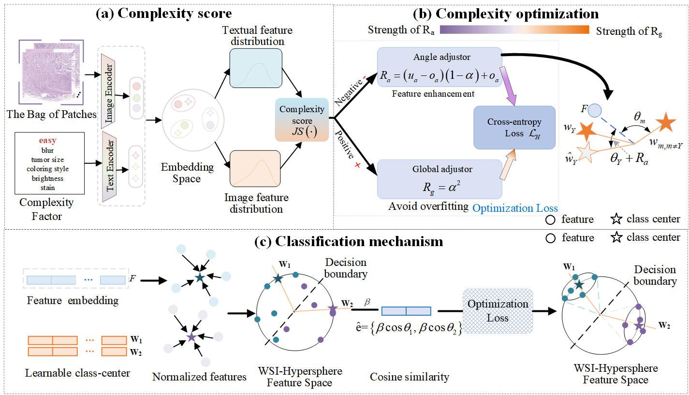

# Exploring Complexity-Calibrated Morphological Distribution for Whole Slide Image Classification and Difficulty-Grading



Abstract: Multiple Instance Learning (MIL) is essential for accurate pathological image classification under limited annotations. Global-local morphological modeling approaches have shown promise in whole slide image (WSI) analysis by aligning patches with spatial positions. However, these methods fail to differentiate samples by complexity during morphological distribution construction, treating all samples equally important for model training. This oversight disregards the impact of difficult-to-recognize samples, leading to a morphological fitting bottleneck that hinders the clinical application of deep learning across centers, subtypes, and imaging standards. To address this, we propose Complexity-Calibrated MIL (CoCaMIL) for WSI classification and difficulty grading. CoCaMIL emphasizes the synergistic effects between morphological distribution and key complexity factors, including blur, tumor size, coloring style, brightness, and stain. Specifically, we developed an image-text contrastive pretraining framework to jointly learn multiple complexity factors, enhancing morphological distribution fitting. Additionally, to reduce the tendency to focus on difficult samples overly, we introduce a complexity calibration method, which forms a distance-prioritized feature distribution by incorporating objective factors during training. CoCaMIL achieved top classification performance across three large benchmarks and established a reliable system for grading sample difficulty. To our knowledge, CoCaMIL is the first approach to construct WSI morphological representations based on the collaborative integration of complexity factors, offering a new perspective to broaden the clinical use of deep learning in digital pathology.

## Dataset
The Camelyon-16 is available at https://camelyon16.grand-challenge.org/.
The TCGA datasets are available at https://portal.gdc.cancer.gov/.
The EBRAINS is available at https://doi.org/10.25493/WQ48-ZGX.


## Installation

- NVIDIA GPU (Nvidia GeForce RTX 4090)
- Python (3.9.13), numpy(1.23.3), opencv-python (4.6), PyTorch (1.13.0), pytorch-lightning (1.8.0)

Please refer to the following instructions.

```bash
# create and activate the conda environment
conda create -n cocamil python=3.9
conda activate cocamil

## conda install
conda install pytorch==1.13.0 torchvision==0.14.0 torchaudio==0.13.0 pytorch-cuda=11.7 -c pytorch -c nvidia
```

## Train


we follow the general WSI processing solution from [this](https://github.com/mahmoodlab/CLAM).

```bash
# WSI Segmentation and Patching
python create_patches_fp.py --source DATA_DIRECTORY --save_dir RESULTS_DIRECTORY --patch_size 256 --preset bwh_biopsy.csv --seg --patch --stitch

# Feature Extraction
CUDA_VISIBLE_DEVICES=0 python extract_features_fp.py --data_h5_dir DIR_TO_COORDS --data_slide_dir DATA_DIRECTORY --csv_path CSV_FILE_NAME --feat_dir FEATURES_DIRECTORY --batch_size 512 --slide_ext .svs
```

```python
python train.py --stage='train' 
```

## Inference

```python
python train.py --stage='test'
```

